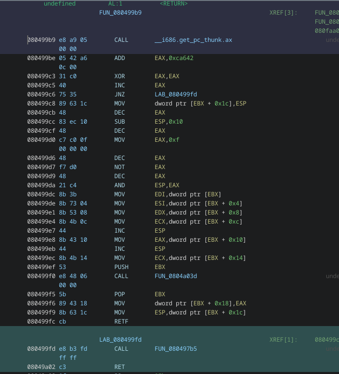

Interesting rev chal from Cyber Apocalypse CTF 2025. I did spend many many hours on it, but i think it's so far the most difficult rev chal I've solved.

As a forenote, this write up is quite long.

## Chal Description
Malakar placed a spell on you that transported you to the Nether world. The only way to escape is to remember the enchantments of your forefathers, and unleash your ability to blast through Aether gateways...

Files: [rev_gateway.zip](/writeups/gateway/rev_gateway.zip)

## Solution

### Control Flow
Running the binary we are met with the following prompt:
```
😈 Malakar has blasted you to the 🔥 Nether 🔥 realms! 😈
🙏 The only way to escape is to teleport to the gateways of the Aether 🙏
And fall down into the mortal realm
Recall the ✨ enchantments ✨ of your forefathers:
```
Where we can then input our *enchantment* to solve the challenge.

We can get a bit more information from `binwalk` and `file`, seems like we're working with a 32-bit ELF, which I hadn't seen in any rev chals before. Also note the unix paths. I'm fairly certain that these are here because the ELF is statically linked. And since it's also stripped, we can use a ghidra GNU plugin later on to name some of the functions.
```sh
❯ file gateway
gateway: ELF 32-bit LSB executable, Intel 80386, version 1 (GNU/Linux), statically linked, BuildID[sha1]=b3c8c27272891690a3d00aa745165056bd7041e0, for GNU/Linux 3.2.0, stripped
❯ binwalk gateway

DECIMAL       HEXADECIMAL     DESCRIPTION
--------------------------------------------------------------------------------
0             0x0             ELF, 32-bit LSB executable, Intel 80386, version 1 (GNU/Linux)
148           0x94            Intel x86 or x64 microcode, sig 0x08111ca8, pf_mask 0x06, 1CA8-08-11, rev 0xc8ca8, size 4
617988        0x96E04         Unix path: /usr/share/locale
619224        0x972D8         Unix path: /usr/share/locale
633450        0x9AA6A         Unix path: /usr/lib/getconf
635128        0x9B0F8         Unix path: /sys/kernel/mm/hugepages
641588        0x9CA34         Unix path: /usr/lib/locale
643556        0x9D1E4         Unix path: /usr/lib/locale/locale-archive
705188        0xAC2A4         ELF, 32-bit LSB processor-specific, (GNU/Linux)
705296        0xAC310         ELF, 32-bit LSB no machine, (SYSV)
```

Opening up the binary in ghidra gives us a pretty funky decompilation.
```c
void FUN_08049b7c(void)
{
  int iVar1;
  undefined4 *puVar2;
  undefined4 *puVar3;
  undefined4 local_1a4 [32];
  undefined4 local_124 [33];
  undefined4 local_a0 [35];
  
  puVar2 = local_a0;
  for (iVar1 = 0x1f; iVar1 != 0; iVar1 = iVar1 + -1) {
    *puVar2 = 0;
    puVar2 = puVar2 + 1;
  }
  puVar2 = local_1a4;
  for (iVar1 = 0x20; iVar1 != 0; iVar1 = iVar1 + -1) {
    *puVar2 = 0;
    puVar2 = puVar2 + 1;
  }
  puVar2 = &DAT_080de860;
  puVar3 = local_124;
  for (iVar1 = 0x20; iVar1 != 0; iVar1 = iVar1 + -1) {
    *puVar3 = *puVar2;
    puVar2 = puVar2 + 1;
    puVar3 = puVar3 + 1;
  }
  return;
}
```

Where is the code 🤔🤔🤔?!?!??

At first glance there doesn't seem to be any function calls here, but looking at the assembly, we can see that we're missing some information here.

We see that two labels are pushed onto the stack, as well as 0x23, and 0x33. The first is just below this code, while the other was detected as a function by ghidra (Note: at the moment of doing the chal, I was not aware of the significance of 0x23 and 0x33, but I'll explain it later as was explained in the official writeup).

Return far (`retf`) is also executed after this, popping the function address off the stack and into the instruction pointer, as well as 0x33 into CS.

Taking a look at that function is also even more funky, since it seems to just call another function.
```c
void FUN_080499b9(void)
{
  FUN_080497b5();
  return;
}
```

Looking at the assembly tells us more monkey business is going on.

Ghidra interprets this code as zeroing eax, then incrementing it by 1 so the `JNZ` instruction always jumps to the end of that function because `eax` should equal `1`.
```asm
080499c3 31 c0           XOR        EAX,EAX
080499c5 40              INC        EAX
080499c6 75 35           JNZ        LAB_080499fd
080499c8 89 63 1c        MOV        dword ptr [EBX + 0x1c],ESP
```
By using a debugger, we can step through the code to see what's actually happening. When we get to the JNZ instruction, eax actually contains 0, meaning the branch is not taken. This confused me a lot at first, and I realized that I'd just have to deal with it, unsure as to why it was happening (it has to do with `CS` being set to `0x33`).

Now we can see what is actually executing. This asm puts arguments into registers, and then calls FUN_0804a03.
For this solution, this function in particular is not very important to understand, so i'll skip over it. What is important is the `RETF` at the end. This ends up popping the first label that was pushed onto the stack into the instruction pointer, and 0x23 into CS.
```asm
080499c8 89 63 1c        MOV        dword ptr [EBX + 0x1c],ESP
080499cb 48              DEC        EAX
080499cc 83 ec 10        SUB        ESP,0x10
080499cf 48              DEC        EAX
080499d0 c7 c0 0f        MOV        EAX,0xf
00 00 00
080499d6 48              DEC        EAX
080499d7 f7 d0           NOT        EAX
080499d9 48              DEC        EAX
080499da 21 c4           AND        ESP,EAX
080499dc 8b 3b           MOV        EDI,dword ptr [EBX]
080499de 8b 73 04        MOV        ESI,dword ptr [EBX + 0x4]
080499e1 8b 53 08        MOV        EDX,dword ptr [EBX + 0x8]
080499e4 8b 4b 0c        MOV        ECX,dword ptr [EBX + 0xc]
080499e7 44              INC        ESP
080499e8 8b 43 10        MOV        EAX,dword ptr [EBX + 0x10]
080499eb 44              INC        ESP
080499ec 8b 4b 14        MOV        ECX,dword ptr [EBX + 0x14]
    080499ef 53              PUSH       EBX
080499f0 e8 48 06        CALL       FUN_0804a03
    00 00
    080499f5 5b              POP        EBX
    080499f6 89 43 18        MOV        dword ptr [EBX + 0x18],EAX
    080499f9 8b 63 1c        MOV        ESP,dword ptr [EBX + 0x1c]
    080499fc cb              RETF
```

This means that we execute the program like this:


Decompiling the next function looks like this:
```c
void UndefinedFunction_08049c4b(undefined4 param_1,undefined4 param_2,int param_3)
{
  undefined4 uStack00000010;
  undefined4 uStack00000018;
  
  uStack00000018 = 0;
  uStack00000010 = 0x8049c60;
  FUN_0805abe0();
  uStack00000010 = 0x8049c72;
  FUN_08058b00();
  uStack00000010 = 0x8049c84;
  FUN_08058b00();
  uStack00000010 = 0x8049c96;
  FUN_08058b00();
  uStack00000010 = 0x8049ca8;
  FUN_08058b00();
  uStack00000010 = 0x8049cba;
  FUN_08052700();
  *(undefined4 *)(param_3 + -0x1bc) = 0;
  *(int *)(param_3 + -0x1b8) = param_3 + -0x9c;
  *(undefined4 *)(param_3 + -0x1b4) = 0x80;
  *(undefined4 *)(param_3 + -0x1b0) = 0;
  *(undefined4 *)(param_3 + -0x1ac) = 0;
  *(undefined4 *)(param_3 + -0x1a8) = 0;
  return;
}
```
By looking at the addreess here in uStack000000010, we can determine that FUN\_08058b00 is print, meaning we have 4 prints, and then FUN\_08052700 is something else (idk, didn't seem important).

The bottom of this function is also pretty funny looking, values are set on the stack (`param_3` is the `base pointer` as they would for a function call. Turns out the same thing that was in main is also happening here.
```asm
08049d01 60              PUSHAD
08049d02 9c              PUSHFD
08049d03 89 c3           MOV        EBX,EAX
08049d05 6a 23           PUSH       0x23
08049d07 8d 05 18        LEA        EAX,[LAB_08049d18]
9d 04 08
08049d0d 50              PUSH       EAX=>LAB_08049d18
08049d0e 6a 33           PUSH       0x33
08049d10 8d 05 d5        LEA        EAX,[FUN_080498d5]
98 04 08
08049d16 50              PUSH       EAX=>FUN_080498d5
08049d17 cb              RETF
```

### What it does

Since this is happening all over the code, I decided to set some fallthroughs in ghidra to make it all one function. Patching the binary probably would've been a better choice and would've led to a nicer decompilation. My method did not label the function calls, but I knew they were there. Anyways, main ended up looking like this after some labeling that I'll explain.
```c
void main(undefined param_1)
{
  int iVar1;
  undefined4 *puVar2;
  undefined4 *puVar3;
  undefined *puVar4;
  undefined4 *puVar5;
  undefined4 *puVar6;
  int in_GS_OFFSET;
  uint auStackY_214 [5];
  undefined4 local_1a4 [32];
  undefined4 local_124 [26];
  undefined4 auStack_bc [6];
  undefined4 local_a4;
  undefined4 local_a0 [31];
  undefined4 local_24;
  undefined *puStack_18;
  
  puStack_18 = &param_1;
  local_24 = *(undefined4 *)(in_GS_OFFSET + 0x14);
  local_a4 = 0;
  puVar5 = local_a0;
  for (iVar1 = 0x1f; iVar1 != 0; iVar1 = iVar1 + -1) {
    *puVar5 = 0;
    puVar5 = puVar5 + 1;
  }
  puVar5 = local_1a4;
  for (iVar1 = 0x20; iVar1 != 0; iVar1 = iVar1 + -1) {
    *puVar5 = 0;
    puVar5 = puVar5 + 1;
  }
  puVar5 = &DAT_080de860;
  puVar6 = local_124;
  for (iVar1 = 0x20; iVar1 != 0; iVar1 = iVar1 + -1) {
    *puVar6 = *puVar5;
    puVar5 = puVar5 + 1;
    puVar6 = puVar6 + 1;
  }
  puVar4 = &stack0xfffffe00;
                    /* IDK WHAT THIS ONE IS*/
  FUN_0805abe0(BASE_PROGRAM_ADDR_08114450,0);
                    /* FUNC_08114068 */
  print?((uint *)puVar6[0x1a]);
                    /* FUNC_080de6a4 MALAKAR  PRINT */
  print?(puVar6 + -0xd657);
                    /* FUNC_0x80de740 */
  print?(puVar6 + -0xd644);
                    /* FUNC_080a8de4 */
  print?(puVar6 + -0xd630);
                    /* FUNC_080de768 */
  iforgot(puVar6 + -0xd626);
  _arg1 = 0;
  _arg2 = 0xffffff87;
  _arg3 = 0x80;
  _arg4 = 0;
  _arg5 = 0;
  _arg5 = 0;
  _len = _ret_val;
  if (_ret_val == 0x21) {
    uRamffffffa7 = 0;
    _len = 0x20;
    puVar4 = &stack0xfffffe00;
                    /* 0 < 0x21 */
    for (_i = 0; _i < _len; _i = _i + 1) {
                    /* these are the args to the hidden function that gets called, the first arg
                       here ends up being a pointer to the first input byte i think, since -0x1cc is
                       0 */
      _arg1 = (uint)*(byte *)(_i + -0x79);
      _arg2 = 0;
      _arg3 = 0;
      _arg4 = 0;
      _arg5 = 0;
      _arg5 = 0;
      *(undefined4 *)(puVar4 + -4) = 0x23;
      *(undefined4 *)(puVar4 + -8) = 0x8049dc3;
      *(undefined4 *)(puVar4 + -0xc) = 0x33;
      puVar2 = (undefined4 *)(puVar4 + -0x10);
      puVar4 = puVar4 + -0x10;
      *puVar2 = xor_shift_thing_caller;
      *(char *)(_i + -0x79) = (char)_ret_val;
    }
    *(int *)(puVar4 + -0xc) = _len;
    *(undefined4 *)(puVar4 + -0x10) = 0xffffff87;
    *(undefined4 *)(puVar4 + -0x14) = 0x8049e0c;
    shuffleinput(*(char **)(puVar4 + -0x10),*(uint *)(puVar4 + -0xc));
    for (_j = 0; _j < _len; _j = _j + 1) {
      _arg1 = _j - 0x79;
      _arg2 = 1;
      _arg3 = 0;
      _arg4 = 0;
      _arg5 = 0;
      _arg5 = 0;
      *(undefined4 *)(puVar4 + -4) = 0x23;
      *(undefined4 *)(puVar4 + -8) = 0x8049e7e;
      *(undefined4 *)(puVar4 + -0xc) = 0x33;
      puVar3 = (undefined4 *)(puVar4 + -0x10);
      puVar4 = puVar4 + -0x10;
      *puVar3 = xor_thing_caller;
      *(int *)(_j * 4 + -0x179) = _ret_val;
    }
    is_win = true;
    for (_k = 0; _k < 0x20; _k = _k + 1) {
      is_win = (*(int *)(_k * 4 + -0x179) == *(int *)(_k * 4 + -0xf9) & is_win) != 0;
    }
    if ((bool)is_win != false) {
                    /* 080de7ac => WIN? */
      *(undefined4 *)(puVar4 + -0x10) = 0xfffca613;
      *(undefined4 *)(puVar4 + -0x14) = 0x8049f1d;
      print?(*(uint **)(puVar4 + -0x10));
                    /* 0811406c => WIN msg 2, something very long idk */
      *(undefined4 *)(puVar4 + -0x10) = _DAT_fffffed3;
      *(undefined4 *)(puVar4 + -0x14) = 0x8049f2f;
      print?(*(uint **)(puVar4 + -0x10));
      goto LAB_08049f4a;
    }
  }
                    /* 0x80de7f0 => WRONG_ENCHANTMENT080de7f0 */
  *(undefined4 *)(puVar4 + -0x10) = 0xfffca657;
  *(undefined4 *)(puVar4 + -0x14) = 0x8049f47;
  print?(*(uint **)(puVar4 + -0x10));
LAB_08049f4a:
  if (_DAT_00000007 == *(int *)(in_GS_OFFSET + 0x14)) {
    return;
  }
                    /* WARNING: Subroutine does not return */
  *(undefined4 *)(puVar4 + -4) = 0x8049f5b;
  stacksmash();
}
```

One very important thing to note is that `DEC` (similarly to `INC`), also doesn't actually do anything here, this can also be confirmed by debugging, so a lot of the assembly has `dec`s scattered around, but they don't do anything and can be ignored.
It's a little long, but there's 4 main things it does (bad naming).
1. `xor_shift_thing_caller`

This modifies each byte of our input a little bit.
```c
uint FUN_0804a118(void)
{
  byte unaff_DI;
  return ((unaff_DI) * 2 & 0xaa) | (unaff_DI - 1 >> 1 & 0x55);
}
```

2. `shuffleinput(*(char **)(puVar4 + -0x10),*(uint *)(puVar4 + -0xc))`

Finally a normal function call that doesn't make me go *bananas*.

This shuffles the input. Here is the main snippet of what's happening in it. It gets random numbers from the function `somethingelseimportant` (mostly not too important), and swaps around values in our already xored input buffer. This produces the *same* mapping every time.
```c
  for (i = 0; i < len; i = i + 1) {
    arg1 = 0;
    arg2 = 0;
    arg3 = 0;
    arg4 = 0;
    arg5 = 0;
    arg6? = 0;
    *(undefined4 *)(puVar2 + -4) = 0x23;
    *(undefined4 *)(puVar2 + -8) = 0x8049b0e;
    *(undefined4 *)(puVar2 + -0xc) = 0x33;
    puVar1 = (undefined4 *)(puVar2 + -0x10);
    puVar2 = puVar2 + -0x10;
    *puVar1 = somethingelseimportant;
    swa_idx = out_val % len;
    uStack_38 = 0;
    tmp = param_1[swa_idx];
    param_1[swa_idx] = param_1[i];
    param_1[i] = tmp;
  }
```

3. `xor_thing_caller` (crc)

This is actually a crc64, but I somehow missed that, and when I tried to implement it in python, I couldn't get the same output as the binary (if I realized this I likely could've solved it a lot faster).

This is actually not very important in my solution, since we end up only caring about the output of it.

```c
    for (_j = 0; _j < _len; _j = _j + 1) {
      _arg1 = _j - 0x79;
      _arg2 = 1;
      _arg3 = 0;
      _arg4 = 0;
      _arg5 = 0;
      _arg5 = 0;
      *(undefined4 *)(puVar4 + -4) = 0x23;
      *(undefined4 *)(puVar4 + -8) = 0x8049e7e;
      *(undefined4 *)(puVar4 + -0xc) = 0x33;
      puVar3 = (undefined4 *)(puVar4 + -0x10);
      puVar4 = puVar4 + -0x10;
      *puVar3 = xor_thing_caller;
      *(int *)(_j * 4 + -0x179) = _ret_val;
    }
```
It gets called in this for loop which goes through each byte in our input, and produces an 32-bit integer in a new buffer at a stack offset of `-0x179`.

4. Flag check

This happens in the main function. It goes through each of the 32-bit integers that it just created, and compares them to another constant buffer at an offset of `-0xf9`.
```c
    is_win = true;
    for (_k = 0; _k < 0x20; _k = _k + 1) {
      is_win = (*(int *)(_k * 4 + -0x179) == *(int *)(_k * 4 + -0xf9) & is_win) != 0;
    }
    if ((bool)is_win != false) {
                    /* 080de7ac => WIN? */
      *(undefined4 *)(puVar4 + -0x10) = 0xfffca613;
      *(undefined4 *)(puVar4 + -0x14) = 0x8049f1d;
      print?(*(uint **)(puVar4 + -0x10));
                    /* 0811406c => WIN msg 2, something very long idk */
      *(undefined4 *)(puVar4 + -0x10) = _DAT_fffffed3;
      *(undefined4 *)(puVar4 + -0x14) = 0x8049f2f;
      print?(*(uint **)(puVar4 + -0x10));
      goto LAB_08049f4a;
    }
```

### Getting the Flag
At first I did try to just implement all this in python and reverse it, but it was not working which confused me for hours.

So I then just went with mapping my input to an output checksum, and then mapping the `win` buffer back to ascii. The first `xor_shift_thing` technically doesn't actually matter overall. What we need to know is how our input is shuffled.

We can read the memory of our input after shuffling, and compare it to our xored input to see how things are shuffled. This looks like this in python (the `xor_shift_thing`) is easy to implement.
```py
guess = list(b"ABCDEFGHIJKLMNOPQRSTUVWXYZ123456")

# xor_shift_thing_caller
for i in range(0, len(guess)):
    b = ((guess[i] * 2) & 0xaa) | ((guess[i] >> 1) & 0x55)
    guess[i] = b

# Read from program memory
swapped = [0xa5, 0xa3, 0xa0, 0x85, 0x89, 0x84, 0xa2, 0xa6, 0xa9, 0x87, 0x8b, 0x33, 0x32, 0x8d, 0xa4, 0x83, 0x86, 0xa8, 0x8c, 0x39, 0x82, 0x8a, 0xaa, 0x38, 0x81, 0xab, 0x8f, 0x31, 0x3a, 0xa1, 0x88, 0x8e]

shuf_map = {}
for i, c in enumerate(guess):
    shuf_map[i] = swapped.index(c)
print(shuf_map)

# output
# shuf_map = {0: 20, 1: 24, 2: 15, 3: 30, 4: 21, 5: 4, 6: 10, 7: 5, 8: 16, 9: 3, 10: 9, 11: 18, 12: 31, 13: 13, 14: 26, 15: 2, 16: 6, 17: 29, 18: 1, 19: 17, 20: 22, 21: 8, 22: 25, 23: 14, 24: 7, 25: 0, 26: 12, 27: 27, 28: 11, 29: 23, 30: 28, 31: 19}
```

The next part requires passing in a bunch of different inputs to the program to get they're checksums, as well as the buffer it should end up being equal to.

Using gdb, we can set some breakpoints when the binary starts comparing things.

The **win** buffer looks like this. As you can see, values like `0xbfab26a6` repeat multiple times, meaning they're all the same character.
```py
target = [
    0xb62a1500, 0x1d5c0861, 0x4c6f6e28, 0x4312c5a, 0x3cd56ab6, 0x1e6ab55b, 0x3cd56ab6, 0xc06c89b,
    0xed3f1f80, 0xbaf0e1e8, 0xbfab26a6, 0x3cd56ab, 0xb3e0301b , 0xbaf0e1e8, 0xe1e5eb68, 0xb0476f7,
    0xb3e0301b , 0x3cd56ab6, 0xbfab26a6, 0xe864d8c, 0x4c6f6e28 , 0x4312c5af, 0xb3e0301b, 0x9d14f94,
    0xee9840ef , 0x3cd56ab6, 0xbfab26a6, 0xbfab26a, 0x9d14f94b , 0xbaf0e1e8, 0x14dd3bc7, 0x9732958,
    0x85a0a3a5, 0xa6a28489, 0x338b87a9, 0x83a48d3, 0x398ca886 , 0x38aa8a82, 0x318fab81, 0x8e88a13
]
```

And our **guess** output might will have the same length, but different values.
```py
guess = list(b"ABCDEFGHIJKLMNOPQRSTUVWXYZ123456")
guess_out = [
    0xedaefdd5, 0xba6103bd, 0x1186fc89, 0x4fc8314, 0x4f59d312, 0x4c6f6e28, 0xb9c65cd2, 0x464902e,
    0xed3f1f80, 0xe788911c, 0xe7197349, 0x3cd56ab, 0x3f7235d9 , 0xb0d68d21, 0xee09a2ba, 0x1807cf2,
    0xe42fce73 , 0xee9840ef, 0xb371d24e, 0x6b8b768, 0x1ba09040 , 0xe4be2c26, 0x46d8e0b4, 0x682c29e,
    0xb0476f74 , 0x457fbfdb, 0x18962d7a, 0x9495cae, 0xc06c89bf , 0x1221a3e6, 0x4cfe8c7d, 0x1b31721
]
```

In GDB:
```
😈 Malakar has blasted you to the 🔥 Nether 🔥 realms! 😈
🙏 The only way to escape is to teleport to the gateways of the Aether 🙏
And fall down into the mortal realm
Recall the ✨ enchantments ✨ of your forefathers: ABCDEFGHIJKLMNOPQRSTUVWXYZ123456

Breakpoint 1, 0x08049f0c in ?? ()
(gdb) x/32x $ebp - 0x19c
0xffffbf4c:     0xedaefdd5      0xba6103bd      0x1186fc89      0x4fc83147
0xffffbf5c:     0x4f59d312      0x4c6f6e28      0xb9c65cd2      0x464902e1
0xffffbf6c:     0xed3f1f80      0xe788911c      0xe7197349      0x3cd56ab6
0xffffbf7c:     0x3f7235d9      0xb0d68d21      0xee09a2ba      0x1807cf2f
0xffffbf8c:     0xe42fce73      0xee9840ef      0xb371d24e      0x6b8b768b
0xffffbf9c:     0x1ba09040      0xe4be2c26      0x46d8e0b4      0x682c29e4
0xffffbfac:     0xb0476f74      0x457fbfdb      0x18962d7a      0x9495caed
0xffffbfbc:     0xc06c89bf      0x1221a3e6      0x4cfe8c7d      0x1b317215
```

Doing this a bunch of times for many different inputs will yield us a map for each checksum and it's corresponding char. We can also incorporate our shuffle map into this.

```py
guess1 = list(b"ABCDEFGHIJKLMNOPQRSTUVWXYZ123456")
guess_out1 = ...
guess2 = list(b"abcdefghijklmnopqrstuvwxyz7890{}")
guess_out2 = ...
guess3 = list(b"!@#$%^&*()_+-=[]\'\":;,.\\|?<>/`~aa") #!@#$%^&*()_+-=[]'":;,.\|?<>/`~aa
guess_out3 = ...
guess4 = list(b"!\"#$%&'()*+,-./0123456789:;<=>?@") # !"#$%&'()*+,-./0123456789:;<=>?@
guess_out4 = ...

def make_map(guess, expected):
    full_map = {}
    for (checksum, idx) in shuf_map.items():
        full_map[guess_out[idx]] = chr(guess[check_sum])
    return full_map

full_map = {}
full_map.update(make_map(guess1, guess_out1))
full_map.update(make_map(guess2, guess_out2))
full_map.update(make_map(guess3, guess_out3))
full_map.update(make_map(guess4, guess_out4))

flag = []
for c in target:
    if full_map.get(c):
        flag.append(full_map[c])
    else:
        #flag.append(hex(c))
        flag.append('X')

new_flag = ""
new_guess = [''] * 32
for (k, v) in shuf_map.items():
    new_guess[k] = flag[v]
print(new_guess)
print(''.join(new_guess))
```

### Flag
This does end up looking pretty ugly, but after mapping it back, we get the string `HTX{r3tf@X_t0_tH3_h3@V3nXg@X3X!}`

As you can see by this output, some of the characters are marked by an X, but we are VERY close to the flag. We are missing 5 characters, and we can easily determine that the first is `B` to make it `HTB`.

This was super weird, but to looking into it more, it seemed like the outputs would be different based on the position. So I also added the outputs for the reverse of each of our original guesses.

This left us with two unknowns: `HTB{r3tf@X_t0_tH3_h3@V3nXg@t3!!}`. This is close enough to guess. `r3tf@X => r3tf@r`, representing the `retf` instruction in the challenge, which stand for `return far`. The other part is `heavenXgate => heavensgate`. In 1337 2p3@k, this could be any of `z, s, 2, S, 5`.
Testing against the binary tells us it's `5`. Giving us the flag `HTB{r3tf@r_t0_tH3_h3@V3n5g@t3!!}`

```
Recall the ✨ enchantments ✨ of your forefathers: HTB{r3tf@r_t0_tH3_h3@V3n5g@t3!!}
ENCHANTMENT CORRECT! YOU HAVE ESCAPED MALAKAR'S TRAP!
```

Full solution: [solution.py](/writeups/gateway/solution.py)

## Notes
I definitely could have gotten this working with no guessing by using something like pwntools to debug the binary and read the crcs for strings made up of only one ascii characters in every position. This should theoretically give a complete map. I'm still not too sure about why the crc is different based on the position though, I was kind of thinking it could be a problem with the debugger and the 32-bit compatability mode interfering somehow? (idk what i'm talking about)

Another note about the nature of the challenge. I've read that this ELF is a polyglot, meaning it will execute the same in both x86 and x64. This comes with some side effects like the `inc` and `dec` instructions being used to offset instructions to make addressing remain the same in both modes, along with the help of `CS=0x33` from `retf`. Take what I'm saying here with a grain of salt, it's well explained in the official write up though.
