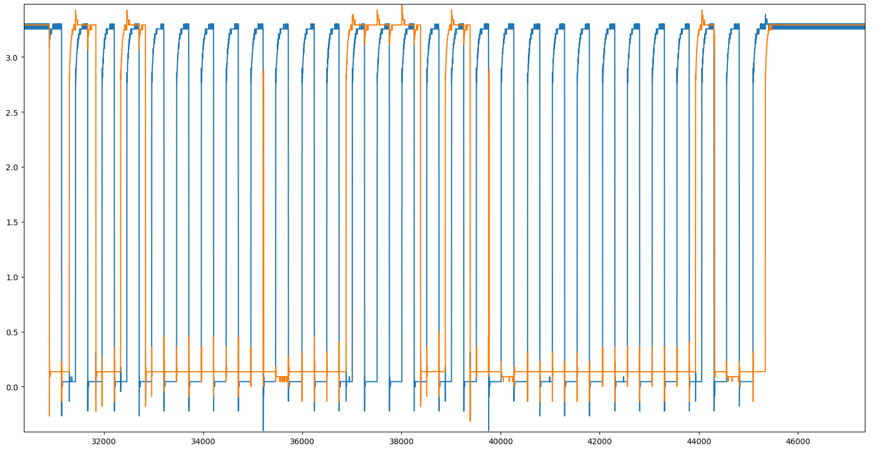

Another interesting rev chal from nullcon goa.\
The premise was to analyze the values from an oscilloscope waveform into the flag.\
Reminded me of **Electronics 1** though.


## Chal Description
I tried to extract some data from an embedded device. Can you help me interpret the data on my oscilloscope?

Files: [`trace.pckl`](/writeups/oscilloscope/trace.pckl)

## Solution
The given file is a pickle file which loads into three different arrays of floats.\
Each is 280000 values long.
```py
import pickle

with open("trace.pckl", "rb") as f:
     time, clock, data = np.array(pickle.load(f))

print(len(time))
print(len(clock))
print(len(data))
```
```
280000
280000
280000
```
Since we know that this should be a waveform from an oscilloscope, we can plot it with matplotlib.
```py
plt.plot(clock)
plt.plot(data)
```
This gives the following waveform.

Zooming in, we can see that the first one (blue), behaves like a clock, and the orange one should be data.


The clock can be cleaned up by setting it to 3.3v if it's above 1.0v.
```py
high = 3.3
low = 0
clock = np.where(clock >= 1.0, high, low)
```


Further inspecting the waveform, we can see that we want to get the indeces where the clock goes from low to high (the positive edges).\
This can be done by looking where the cleaned up clock switches from 0 to 1:
```py
pos_edge = np.where((clock[:-1] == low) & (clock[1:] == high))[0]
```

Getting the bits from the data channel can be done by checking if its above a certain threshold at each pos edge index.
```py
bin = np.array([int(data[int(c)] > 2.8) for c in pos_edge])
```

At first this data might look like garbage, but wheen manually looking at the bits, I was able to see that a character occured every 9 bits, with the first 8 being the byte data (this is how i2c works).\
The first 37 bits have to be ignored (the initial blip of bits at the start).
```py
flag = ""
for i in range(37, len(bin), 9):
    c = int(''.join(str(bit) for bit in bin[i:i+8]), 2)
    flag += chr(c)
    print(flag)
```

### Flag
Now we can get the flag.
Flag: `ENO{S0_TH15_15_H0W_Y0U_D3C0D3_I2C}`

Solution script: [`oscilloscope.py`](/writeups/oscilloscope/oscilloscope.py)
